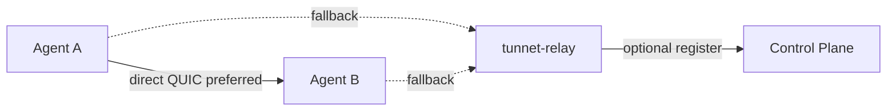

# Connectivity Relay

The Tunnet connectivity relay (`tunnet-relay`) is a thin wrapper around the official [iroh-relay](https://docs.rs/iroh-relay) server. Agents use it as a mesh NAT-traversal fallback (DERP-style) when direct peer-to-peer QUIC fails.

## How it differs from Edge

| | Edge (`tunnet-edge`) | Connectivity relay (`tunnet-relay`) |
|--|----------------------|-------------------------------------|
| Purpose | Public ingress for `tunnet tunnel` | Mesh relay / hole-punch assist |
| Protocol | `tunnet/edge/1` (EdgeCtrl) | iroh-relay HTTP(S) / QUIC |
| Who connects | Agents reverse-tunnel; internet clients hit the edge | Agents only (iroh Endpoints) |
| Binary | `tunnet-edge` | `tunnet-relay` |

## Architecture

Managed agents receive an effective relay map from the control plane (`RelayMode::Custom`). Direct / serverless agents typically use the public n0 relays unless you point them at your own `tunnet-relay`.

## When to run one

- You want mesh traffic to stay on infrastructure you operate
- Cloud / enterprise deployments that disable public n0 relays
- Self-hosted control planes that advertise org or deployment relays

## Next steps

- [Self-host a connectivity relay](/self-hosting/relay)
- [CLI: tunnet-relay](/cli/relay)
- [Public tunnel Edge](/products/edge/) (different component)
