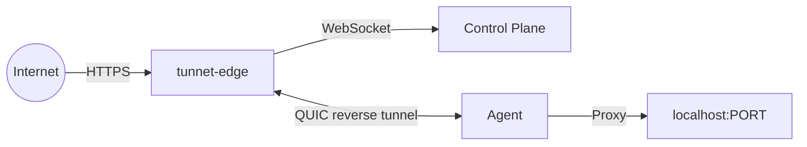

# Edge

The Tunnet edge is a self-hosted edge server that terminates public tunnels. Agents establish reverse tunnels to the edge, and the edge accepts public HTTPS (and TCP) connections and forwards them to the appropriate agent.

## How it competes

The edge competes with **Cloudflare Tunnel's edge network** and **ngrok's infrastructure**. The difference is that you own and operate the edge servers. You control the DNS, the certificates, the geographic placement, and the capacity.

## Architecture

The edge registers itself with the control plane via WebSocket. When a tunnel is created, the control plane assigns it to an edge and provides the agent with the edge address and auth token. The agent establishes a reverse QUIC connection to the edge. Public traffic arrives at the edge and is forwarded through this reverse connection.
